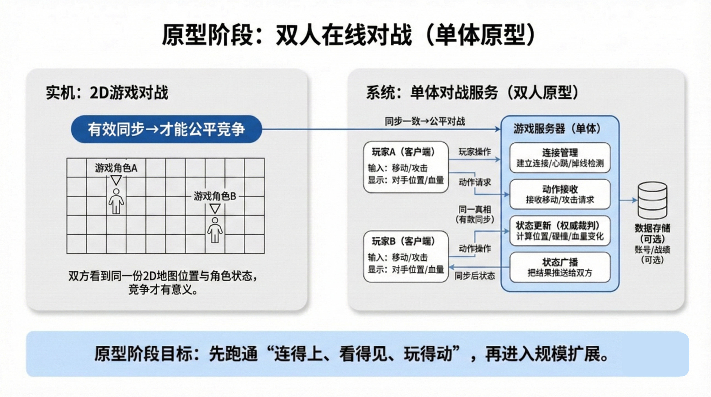
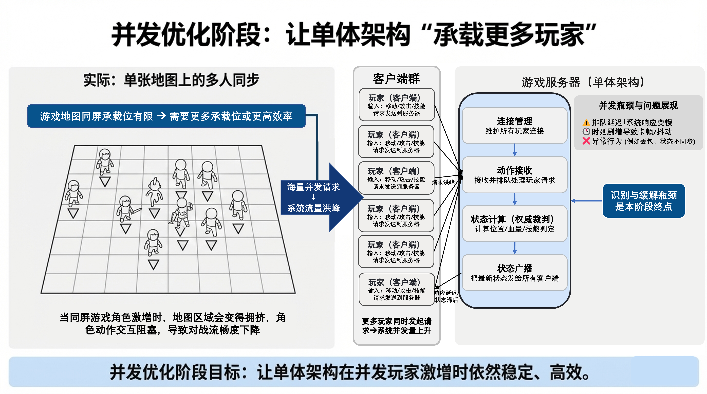
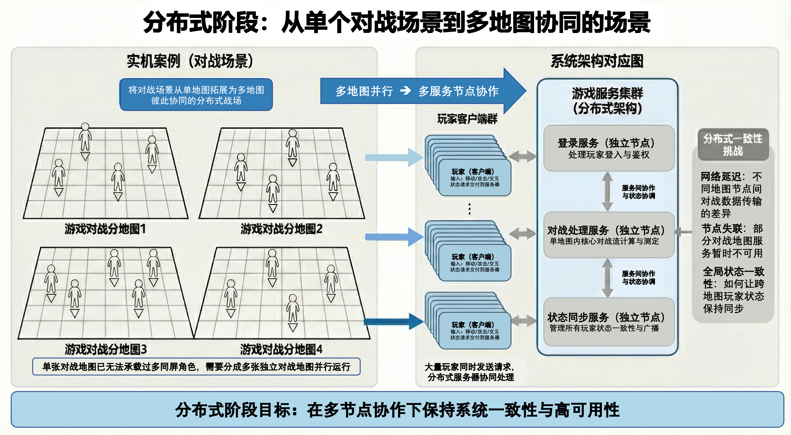
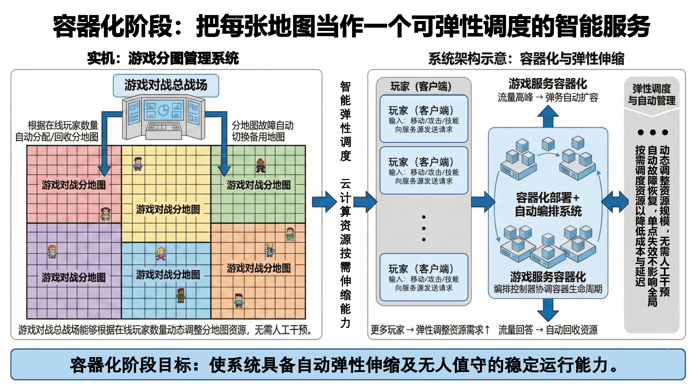
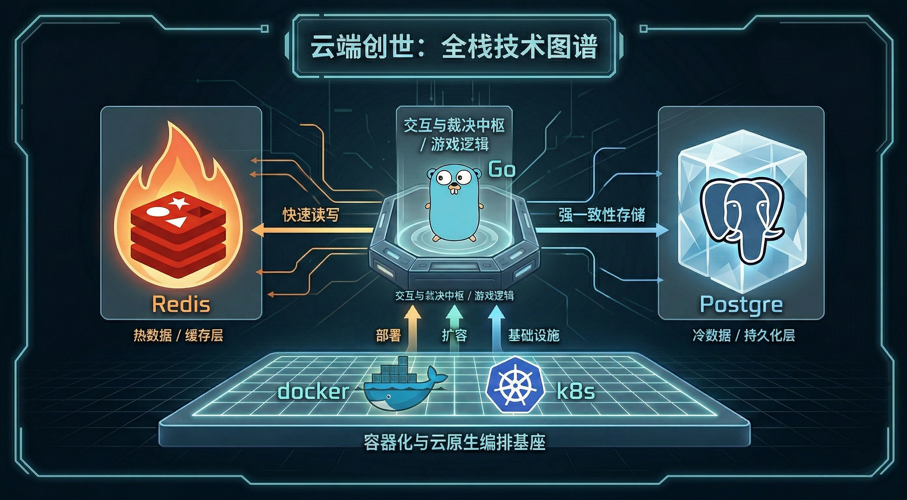

# 云计算技术实践

## 云端创世：从一行代码到游戏纪元

欢迎来到“云端创世”项目！本项目并非仅仅是一个简单的网络游戏代码库，而是一套**从零开始、循序渐进的云原生与分布式系统工程实战指南**。

在过去的二十年里，云计算已成为当今网络世界的“水电煤”。然而，许多开发者在面对海量用户、高并发流量和复杂状态同步时，依然会遇到单机架构的现实“天花板”。为了打破“懂工具却不懂运用”的困境，本项目选择了一个最能放大云计算核心矛盾的场景——**多人在线实时对战游戏**，带你亲手搭建一个顺畅、可按需扩展且状态一致的在线世界。

------

### 📖 在线阅读

为了提供更佳的学习与查阅体验，本项目已上线完整内容，并提供以下两种格式供读者根据习惯自由选择：

- 📄 **[在线阅读（PDF 文档版）](https://ashionial.github.io/CloudComputingBookPresentation/)**
- 🔗 **[在线阅读（Markdown 网页版）](https://ashionial.github.io/CloudComputingMarkdown/)**

------

## 🎯 核心挑战与解决目标

游戏场景天然放大了云计算需要解决的三大核心难题。本项目将带你逐一击破：

- **极致性能（低延迟与高吞吐）：** 解决“团战卡顿、操作不跟手”的问题。通过并发调度、热点数据优化与锁粒度控制，让“顺滑”成为可被设计出来的结果。
- **灵活弹性（自动扩缩容与故障自愈）：** 告别“开服排队、活动炸服、低谷浪费”。利用云原生技术将算力化为资源池，实现按需伸缩与无人工干预的故障恢复。
- **状态同步（分布式一致性）：** 解决“跨区瞬移、不同步”的割裂感。制定明确的跨区通信、数据迁移与状态合并机制，保证千万人眼中看到的是“同一个世界”。

------

## 🗺️ 架构演进路线图

本项目的学习与开发路线被精细划分为四道连续的“装配线工序”，模拟了真实商业项目从原型到云端大作的演进过程：

1. **原型阶段（单体架构闭环）：** 确立客户端-服务端（CS）架构。实现基础的权威裁决与消息化交互，跑通双人同图对战的最小可行性闭环。

   

2. **并发优化阶段（高性能单体）：** 引入 Goroutine 轻量级线程、细粒度锁机制与资源池化技术，突破单机处理瓶颈，实现同一地图内的海量并发。

   

3. **分布式阶段（多机协作与服务拆分）：** 打破单机内存与 CPU 限制，实现多图多服。解决跨服通信、状态无缝迁移以及基于日志（持久化）的容错恢复。

   

4. **容器化与云原生阶段（调度中枢）：** 全面引入 Docker 与 Kubernetes (K8s)。将服务打包为标准副本，实现业务侧的弹性扩缩容、故障自愈与自动化运维。

   

------

## 📖 章节结构与核心技术导读

本项目包含六个核心章节，从最基础的网络连通性出发，一步步深入到云原生的底层内核。无论你是想探究 Go 语言在游戏服务端的并发实践，还是想理解 Kubernetes 的调度机制，都能在这里找到答案：

* **第一章 创世之光：你的第一个在线世界**
  * **内容：** 建立全局系统认知，探讨从单机游戏到多人在线系统的工程边界。
  * **核心：** 确立冷热数据分离（Redis + PostgreSQL）与 CS 架构的基础蓝图。
* **第二章 双雄对决：第一个双人在线游戏**
  * **内容：** 从零开始打破单机封闭性，手写 Socket 网络编程，构建最小化的双人 P2P 与 CS 对战原型。
  * **核心：** 解决视图一致性与信任边界问题，确立“权威服务器裁决”与“客户端意图上报”的交互铁律。
* **第三章 英雄集结：让世界容纳千军万马**
  * **内容：** 直面海量玩家同图带来的性能瓶颈。在单机资源极限下，利用 Go 语言原生特性榨干硬件性能。
  * **核心：** Goroutine 轻量级调度、Channel 异步消息解耦、Mutex 细粒度锁的竞态条件控制，以及 Sync.Pool 的对象复用与数据库连接池技术。
* **第四章 从单机到多机：分布式游戏世界的地基**
  * **内容：** 突破单机物理极限，将世界切分为“互联群岛”。通过跨服擂台实战，解析分布式系统中的痛点。
  * **核心：** 数据库的一致性哈希（Consistent Hashing）分片、负载均衡的动态权重调度、分布式事务的业务层规避策略，以及基于 Raft 协议的协调服务器集群设计。
* **第五章 飞升入定：将游戏世界部署到云端**
  * **内容：** 告别手工运维，实现系统的高可用与自动化管理。
  * **核心：** Docker 镜像分层构建、Docker Compose 一键启停、Kubernetes（K8s）的声明式编排（Deployment/Service），以及 HPA 弹性伸缩和 Serverless 混合架构。
* **第六章 屠龙之术：云原生核心原理**
  * **内容：** 打开云原生工具的“黑盒”，深入探究底层操作系统与网络机制。
  * **核心：** Linux Namespace（视图隔离）与 Cgroups（资源限制）、OverlayFS 分层文件系统、veth 与 bridge 的网络虚拟化原理，以及手写迷你 HPA 控制器的原理解析。

----

## 🛠️ 全栈技术图谱

为了支撑高并发、强实时与高可用的目标，本项目精选了以下现代云原生技术栈：

- **核心开发语言：** **Go (Golang)** —— 利用其原生的高效并发模型（Goroutine）作为交互与裁决中枢。
- **热数据存储（高速缓冲层）：** **Redis** —— 负责高频读写、强实时性、极低延迟的数据（如会话状态、实时位置坐标）。
- **冷数据存储（持久化层）：** **PostgreSQL** —— 负责低频更新、要求强一致性与长期安全保存的数据（如用户账号、持久化资产）。
- **云原生基础设施：** **Docker & Kubernetes (K8s)** —— 提供标准化容器打包、自动化编排、弹性伸缩与健康监测。
- **通信协议：** 基于明确结构的 **JSON / 消息化通信**（后续演进至更高效的 RPC/序列化协议）。

------

## 👤 编者信息

- **核心编者 / 架构设计：** [陈果](https://grzy.hnu.edu.cn/site/index/chenguo)、徐方林、胡文举、庞海鑫、谢先衍、贺臻、张道平
  - *所属单位*：HNU GuoLab（湖南大学）
  - *联系邮箱*：`guochen@hnu.edu.cn`, `xfl825@hnu.edu.cn`

- **贡献者团队：** 欢迎通过 Pull Request 加入我们

------

## 📄 版权信息

**Copyright © 2026 GuoLab. All Rights Reserved.**

本项目中的所有文档、源代码及随附的架构图表均受版权法保护。

- **学习与个人使用：** 允许并鼓励开发者克隆本仓库用于个人学习、研究与非商业性质的实践。
- **商业用途：** 未经编者（陈果及项目管理方）的明确书面许可，严禁将本项目中的核心逻辑、代码或文档直接用于商业化产品、付费课程或出版物中。
- **开源协议：** 本项目目前采用 "仅限内部学习" 协议，详情请参阅仓库根目录下的 `LICENSE` 文件。