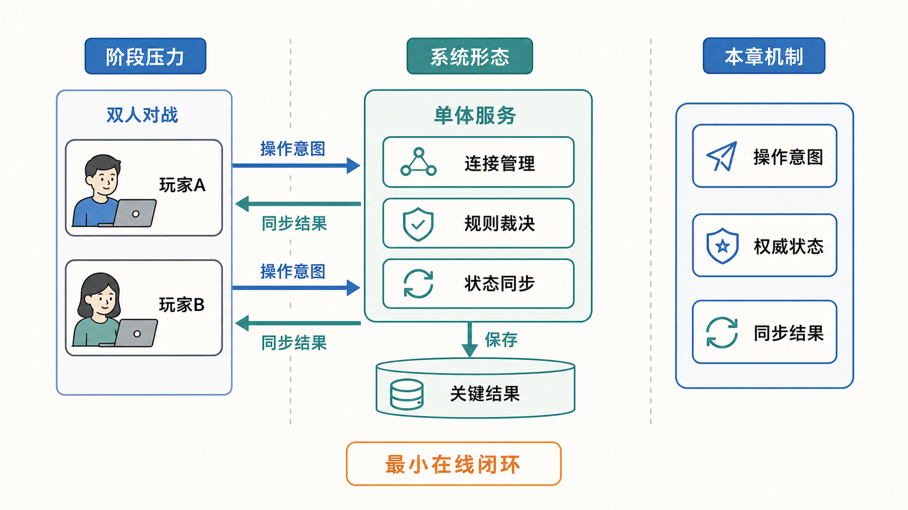
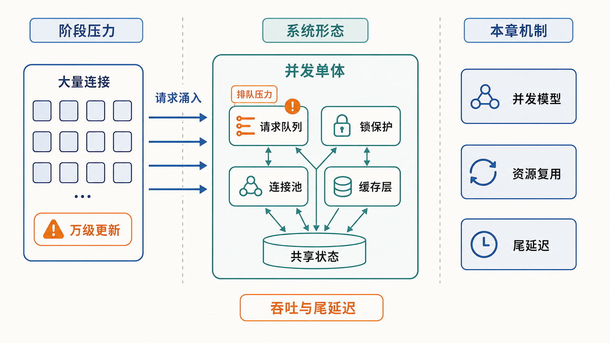
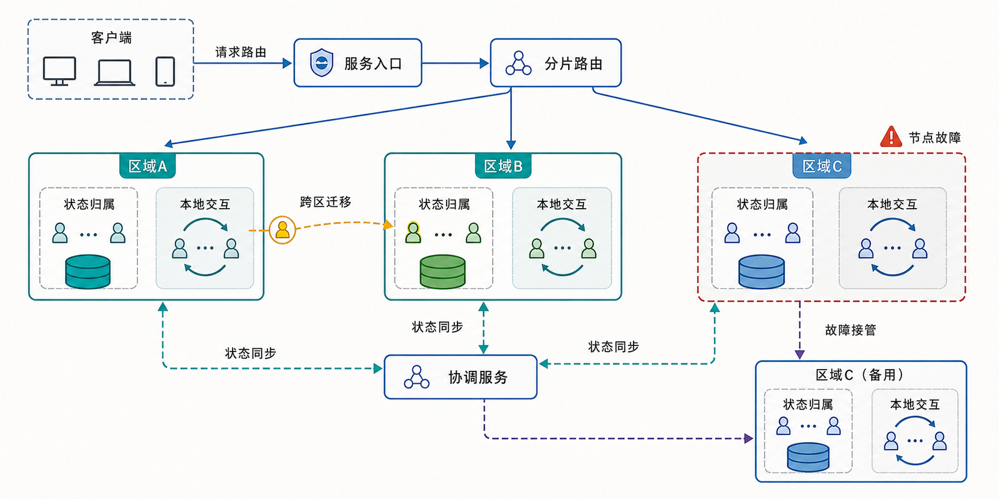
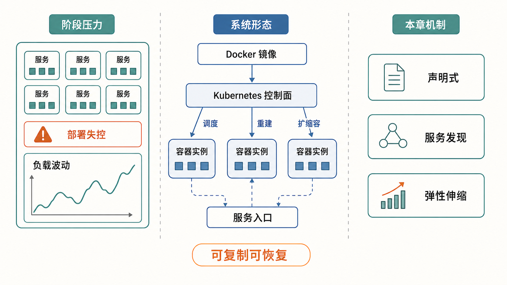
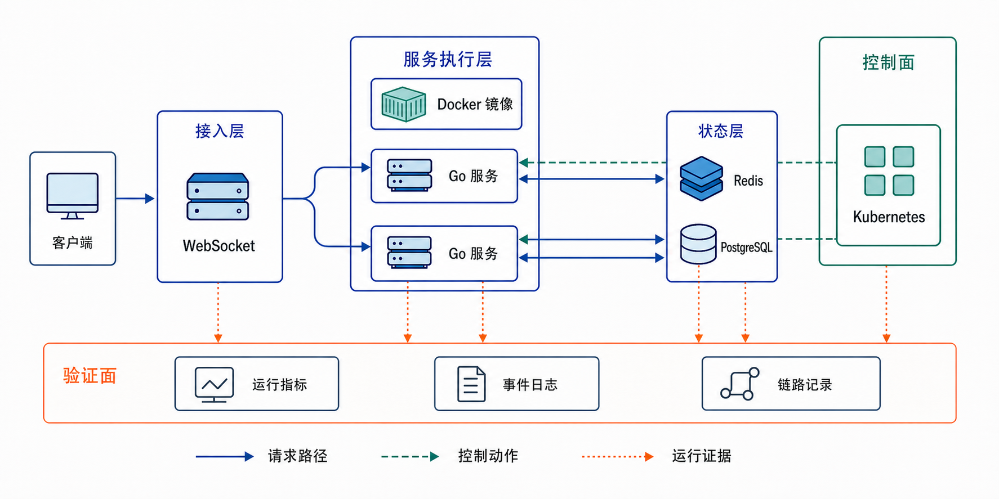

# 云计算技术实践

## 云端创世：从一行代码到游戏纪元

《云计算技术实践》以多人在线实时对战游戏为贯穿案例，讲解在线系统从单机原型走向并发优化、分布式扩展和云原生部署的完整演进过程。

本书不以工具罗列为主，而是围绕延迟、吞吐、状态一致性、故障恢复和弹性伸缩等工程问题，说明系统为什么需要演进、每一步解决什么问题，以及新机制会带来哪些约束。

## 在线试读

本项目公开引言和第一章完整内容，提供两种阅读方式：

- [PDF 文档版](https://hnu-cloudcomputing.github.io/CloudComputingPDF/)
- [Markdown 网页版](https://hnu-cloudcomputing.github.io/CloudComputingMarkdown/)

## 核心问题

多人在线游戏集中体现了云计算系统中的三类问题：

- **性能：** 控制交互延迟，提高系统在高并发压力下的有效吞吐。
- **状态正确性：** 明确状态权威、同步路径和恢复条件，使不同参与者获得一致、可解释的结果。
- **弹性与可用性：** 根据负载调整容量，限制故障影响范围，并在异常后恢复服务。

## 架构演进路线

全书沿着四个阶段展开，从最小在线闭环逐步演进到由云平台持续治理的在线系统。

1. **建立最小在线闭环：** 采用客户端—服务器架构，完成连接管理、规则裁决、状态同步和关键结果保存。

   

2. **提高单机并发能力：** 引入并发模型、资源复用和共享状态保护，缓解请求排队与尾延迟问题。

   

3. **扩展到多台机器：** 通过服务入口、分片路由、跨区迁移、状态同步和故障接管突破单机容量限制。

   

4. **交给平台持续治理：** 使用 Docker 和 Kubernetes 统一交付与调度，实现服务发现、故障重建和弹性伸缩。

   

## 章节结构

全书共六章，目前公开引言和第一章。

- **第一章 谋定全局：在线系统与云计算**
  - 建立在线系统的整体视图，说明性能、状态正确性、可扩展性、可用性和成本之间的关系。
  - 给出从双人对战原型到云平台治理的四阶段架构路线。
- **第二章 双雄对战：网络通信**
  - 从传输通道和消息边界出发，构建 P2P 原型与权威服务器。
  - 讨论连接管理、状态裁决、可靠交付、超时、幂等及 TCP/UDP 取舍。
- **第三章 英雄集结：单机并发**
  - 分析顺序处理、尾延迟、进程、线程、goroutine 与 I/O 多路复用。
  - 讨论共享状态保护、锁粒度、连接池、对象池、缓存分层和性能验证。
- **第四章 切分世界：分布式系统**
  - 通过分片、路由、动态迁移和入口调度实现多机扩展。
  - 讨论跨服协同、分布式事务、复制、故障恢复、Raft 与一致性取舍。
- **第五章 飞升入定：云原生部署**
  - 介绍容器构建、分发和运行的标准化交付流程。
  - 讨论 Docker Compose、Kubernetes、调谐循环、弹性伸缩和故障自愈。
- **第六章 穷理尽微：云原生核心原理**
  - 解释 Namespace、Cgroups、OverlayFS、容器网络和弹性调度的底层机制。
  - 进一步讨论高并发 Agent Sandbox 的控制面、执行面、交互面、状态面和验证面。

## 技术架构

示例系统由以下部分组成：

- **接入层：** 使用 WebSocket 建立客户端与服务端之间的双向通信通道。
- **服务执行层：** 使用 Go 组织并发服务，并通过 Docker 镜像实现标准化交付。
- **状态层：** Redis 承载高频状态访问，PostgreSQL 保存需要持久化的数据。
- **控制面：** Kubernetes 负责服务编排、调度和运行状态治理。
- **验证面：** 通过运行指标、事件日志和链路记录检查系统行为与设计目标是否一致。

## 编者信息

- **核心编者与架构设计：** [陈果](https://grzy.hnu.edu.cn/site/index/chenguo)、徐方林、胡文举、庞海鑫、谢先衍、贺臻、张道平
- **所属单位：** 湖南大学 HNU GuoLab
- **联系邮箱：** `guochen@hnu.edu.cn`、`xfl825@hnu.edu.cn`、`ashionial@hnu.edu.cn`

## 版权与使用说明

Copyright © 2026 GuoLab. All Rights Reserved.

本项目中的文档、示例代码和架构图表均受版权保护。公开内容可用于个人学习、学术研究和非商业教育实践；未经书面许可，不得用于商业产品、付费课程、培训项目或商业出版物。完整条款请参阅 [LICENSE](./LICENSE)。
